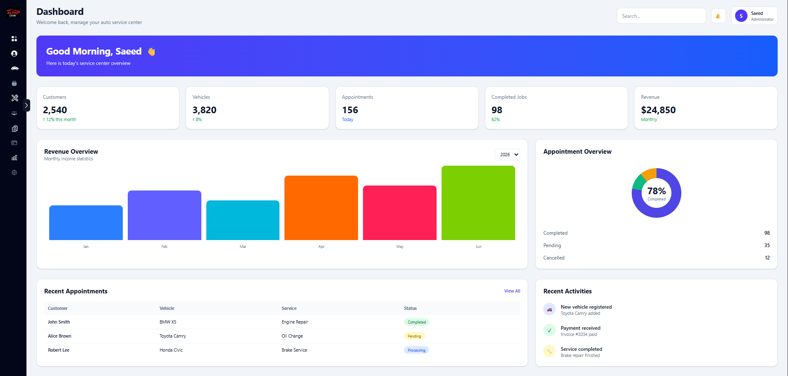

<h1 align="center">
  AutoCare CMS Dashboard 🚗
</h1>

<p align="center">
  
</p>

<p align="center">
  A modern car service management dashboard frontend built with HTML, Tailwind CSS, and JavaScript.
</p>


AutoCare CMS is designed to help car service businesses manage customers, vehicles, appointments, services, employees, and daily operations through a responsive dashboard interface.

---

## 🚀 Live Demo

[View AutoCare CMS](https://cms-frontend-yhr-cms-frontend.runflare.cloud/)


---

## 🛠️ Tech Stack

### Frontend
<p align="left">
  
  
  
  
</p>

### Tools
<p align="left">
  
  
</p>
---
## 🏢 Dashboard Modules

- 👨‍💼 Admin Dashboard
- 👥 Customer Management
- 🔧 Mechanics Workspace
- 🚗 Auto Body Repair Management
- 🧽 Car Wash Management
- 🛞 Tire & Oil Change Services
- 📋 Receptionist Panel
## ✨ Features

- Responsive CMS dashboard layout
- Persian RTL interface support
- Multi-role dashboard structure:
  - Admin
  - Customer
  - Mechanics
  - Receptionist
  - Car wash staff
  - Auto body repair staff
  - Tire and oil change staff
- Modular JavaScript architecture
- Reusable components system
- Dynamic component loading
- Authentication pages
- API integration with backend
- Search and filtering functionality
- Form validation
- Tailwind CSS based styling system
---

## 📂 Project Structure

```text
frontend/
│
├── pages/
│   ├── Admin/
│   ├── Auto-body-repair/
│   ├── Car-wash/
│   ├── Customer/
│   ├── Mechanics/
│   ├── Receptionist/
│   └── Tire-and-oil-change/
│
├── public/
│   ├── Components/
│   ├── fonts/
│   └── images/
│
├── scripts/
│   ├── components/
│   ├── funcs/
│   ├── models/
│   ├── pages/
│   ├── config.js
│   ├── index.js
│   └── register.js
│
├── shared/
│
├── src/
│   └── input.css
│
├── styles/
│   └── app.css
│
├── index.html
├── package.json
└── vite.config.js
```

---

## 📌 Project Status

The project is actively under development.

### ✅ Completed

- Project architecture
- Dashboard layout
- Responsive design
- Sidebar component
- Component loading system
- Authentication UI
- API integration
- Frontend deployment

### 🚧 In Progress

- Customer dashboard
- Data tables
- Advanced search and filtering
- More CMS modules

### 🔮 Future Improvements

- Dark/light theme
- Dashboard analytics charts
- More animations
- Advanced role-based permissions

---

## 🖥️ Dashboard Preview



---

## ⚙️ Installation

Clone the repository:

```bash
git clone YOUR_FRONTEND_REPOSITORY_URL
```

Go to the project folder:

```bash
cd frontend
```

Install dependencies:

```bash
npm install
```

Start development server:

```bash
npm run dev
```

Build for production:

```bash
npm run build
```

---

## 🔗 Backend

This frontend communicates with a separate backend API.

Backend technologies:

- Node.js
- Express.js
- MongoDB
- Mongoose
- JWT Authentication

---

## 👨‍💻 Author

**Saeed Ebrahimi**

Frontend Developer passionate about JavaScript and modern web technologies.

Currently learning:

- React
- Next.js
- TypeScript

---

⭐ If you find this project interesting, feel free to explore the repository and follow the development journey.